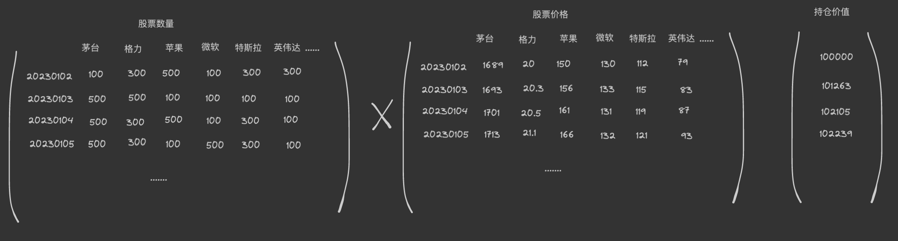

向量化的回测方式是最经典且快速的回测方式。
通过向量化计算的方式，批量计算，快速得出想要的结果。
repo 里面有.py 代码自行看看就明白。

### 下面我用excel 作一个可视化的简单演示。

1、行情数据
通常的， 我们会接收到开盘价、最高价、最低价、收盘价、成交量等行情数据。像下面这样。

2、计算信号/因子
我们设计交易策略， 按照交易策略执行我们的交易。
例如，我们设定的交易策略为: 周期10的均线 > 周期50的均线时，就买入，否则就卖出直到持仓为0.

我们首先应该计算这两个因子值， sma10 与 sma50.

3、执行交易策略
我们应该按照设定执行交易策略， 并得到交易持仓。

4、交易账户
这里我们虚拟了一个交易账户， 我们能看到在某一次交易中，position仓位变化了，对应的持仓价值position_value 也对应变化，现金cash 也对应变化了。

5、标的价格归一与单位净值
让交易标的的价格 与 账户的净值在同一数量级之下， 都进行了归一化处理。

6、作图
我们画出我们想要的结果。橙色线表达交易标的物的价格变化，蓝色线比较交易策略的对应净值曲线。

更进一步的：
我们能稍微畅享多个品种做交易回测， 如果是向量化的计算方式，应该如何。
